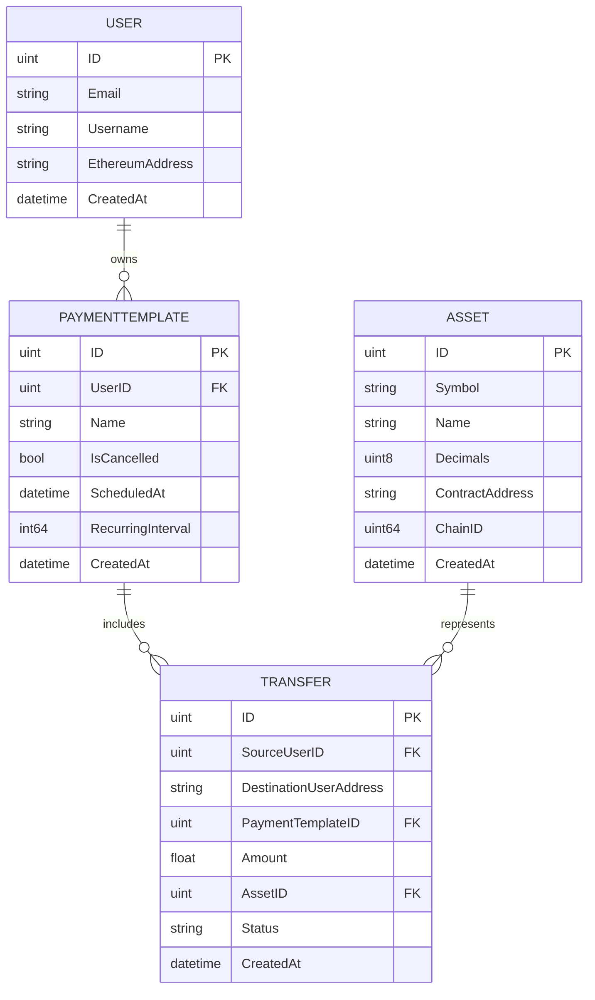

# Project Overview

This project was created to address a common limitation in existing crypto wallets. As companies and institutions increasingly adopt blockchain stablecoins and other crypto assets for payments, subscriptions, payroll, and other financial operations, there is a need for more advanced transaction management. Most wallets today allow users to create single transactions, but there is no easy way to batch multiple actions or schedule payments in the future.

Our project solves this problem by providing a user-friendly platform that enables single, batch, and scheduled payments, along with features for managing recurring payments and templates efficiently.  

---

# Features

- **Single & Batch Payments**: Users can create both single transactions and batch payments through an intuitive UI.  
- **Scheduled Payments**: Payments can be scheduled for a future date or set as recurring for subscriptions.  
- **Templates Management**:  
  - All single, batch, and scheduled payments are stored as reusable templates.  
  - Users can view the history of their templates.  
  - Templates can be exported as CSV files.  
  - Templates can be imported back for re-execution or minor modifications before executing again.  
  - Users can delete or rename templates.  
- **User Authentication**: Login once and receive a JWT that keeps the user authenticated.  
- **Asset Overview**: Users can view all assets supported by the platform.

# Tech Stack

## Backend
- **Language & Framework**: Go  
- **ORM & Database**: GORM + MySQL  
- **Libraries / Utilities**:  
  - `go-ethereum` for:  
    - Checking signatures  
    - Creating and executing transactions  
  - `github.com/golang-jwt/jwt/v5` for JWT-based authentication  

## Frontend
- **Framework & Language**: React with TypeScript  
- **UI Libraries**:  
  - Bootstrap  
  - `react-bootstrap-icons`  
- **Blockchain Utilities**:  
  - `ethers.js` for parsing and handling Ethereum data  
- **Wallet Tested**: Demo tested with Ambire Wallet


# Architecture

## Database Layout

The database is structured to support users, payment templates, transfers, and blockchain assets. The key models and their relationships are described below.

### Models

#### **User**
Represents a user of the platform.  
- `Email` and `Username` are optional to support anonymous users.  
- `EthereumAddress` is required and unique for each user.  
- A user can have multiple `PaymentTemplates`.

#### **PaymentTemplate**
Represents a reusable payment structure, which can be executed immediately, scheduled for the future, or set to recur.  
- Linked to a `User` via `UserID`.  
- Can have multiple `Transfers`.  
- Fields:  
  - `ScheduledAt` → optional date/time for future execution  
  - `RecurringInterval` → optional interval in seconds for recurring payments  
  - `IsCancelled` → indicates if the template has been cancelled  

#### **Transfer**
Represents a single transfer of an asset from a user to a destination address.  
- Belongs to a `PaymentTemplate`.  
- Linked to a source `User` and an `Asset`.  
- Tracks `Amount` and `Status` (pending, completed, failed, etc.).  

#### **Asset**
Represents a blockchain asset (token or coin).  
- `Symbol` and `Name` identify the asset.  
- `Decimals` indicate precision.  
- `ContractAddress` is optional for ERC-20 tokens.  
- `ChainID` specifies the blockchain network.  

---

### Database Schema (Mermaid ER Diagram)



## Backend Routes

The backend exposes several REST endpoints to manage users, payment templates, and assets. Most routes require JWT authentication.

### **Authentication**
- `POST /generate-token` → Accepts a signed ethereum passage via the user's private key. Generates a JWT token for the user to access protected routes. Also creates a user. 

### **User Routes**
- `GET /users/{userAddress}` → Retrieves user details by Ethereum address (JWT protected).

### **Payment Template Routes**
- `GET /templates/{userAddress}` → Retrieves all templates for a specific user (JWT protected).  
- `POST /templates/{userAddress}` → Creates a new payment template for a user (JWT protected).  
- `DELETE /templates/{templateId}` → Deletes a specific template by ID (JWT protected).  
- `PUT /templates/{templateId}` → Updates a specific template (e.g., rename or cancel) (JWT protected).

### **Asset Routes**
- `GET /assets` → Retrieves all supported blockchain assets (no authentication required).

---

## Frontend Routes

The React frontend uses React Router to manage the app views:

- `/` → Home page (dashboard for creating payments and viewing templates, allows CSV import).  
- `/assets` → Assets page (lists all supported assets).  
- `/history` → History page (shows template history, allows CSV export).


# Installation & Setup

This section explains how to set up the backend and frontend locally.

---

## Backend Setup (Go)

1. **Environment Variables**  
   Create a `.env` file in the backend root with the following variables:  

```env
   DB_USER=<your_db_username>
   DB_PASS=<your_db_password>
   EXECUTOR_SEED="<mnemonic_seed_phrase_for_backend_account>"
```

Note: The `EXECUTOR_SEED` account will be used by the backend to execute scheduled payments. Make sure this account is funded with Ethereum for transaction execution.

2. **Seed Initial Data**

Navigate to the seeding script folder and run the seeding program to populate the database with initial assets:

```bash
cd backend/cmd/seed
go run main.go
```


3. **Start the Backend Server**

Once the database is seeded, start the backend server:

```bash
cd backend/
go run main.go
```

## Frontend Setup (React)

1. **Install Dependencies**

Navigate to the frontend folder and install all dependencies:

```bash
cd frontend
npm install
```

2. **Start the Frontend**

```bash
npm run dev
```

# User Manual

## Home Page
1. **Login**
   - Connect your Ethereum wallet.  
   - Sign a message to authenticate.  
2. **Create Payment Templates**
   - Single or batch payments.  
   - Execute immediately, schedule for the future, or make recurring.  
   - Import a CSV to create a template from existing data.

## Assets Page (`/assets`)
- Displays a list of all blockchain assets supported by the app.

## History Page (`/history`)
- Shows a list of all saved payment templates.  
- For each template, users can:  
  - Delete it.  
  - Rename it.  
  - Export it as a CSV.  
  - Execute the template immediately via their Ethereum wallet.

